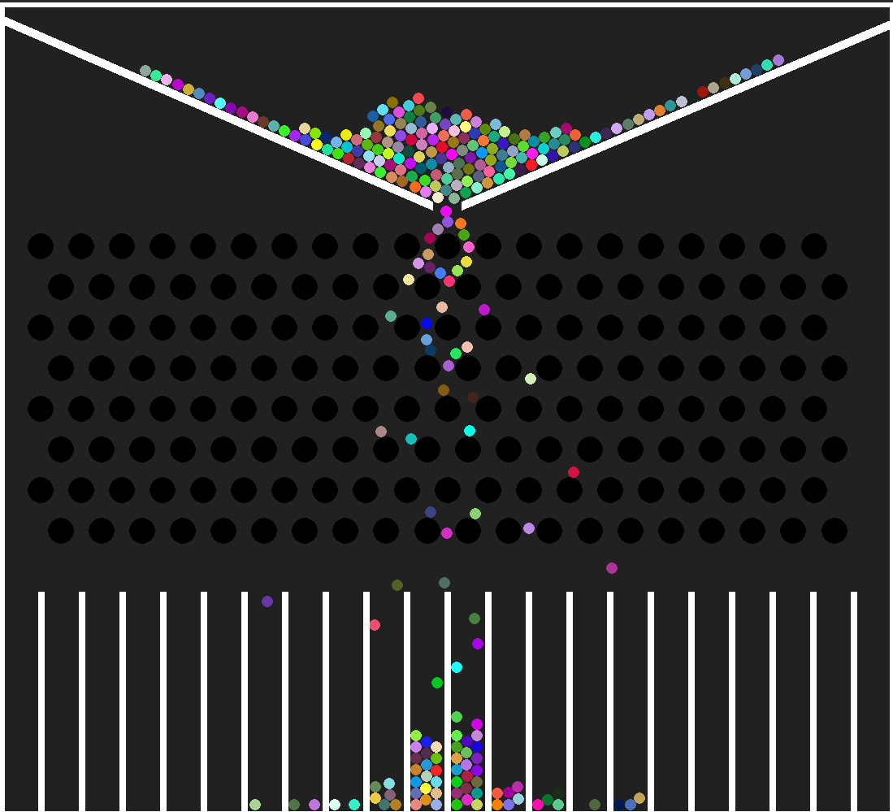

# Galton-Board
[Galton board](https://en.wikipedia.org/wiki/Galton_board) simulation that displays the gaussian distribution using 250 balls.

# Libraries
- Pygame - Scene rendering
- Pymunk - 2d physics library to assist with rigid body collisions
